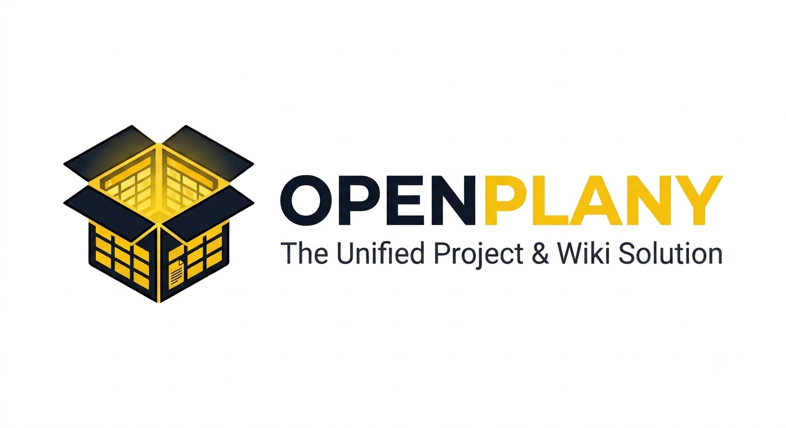

<p align="center">
  
</p>

<p align="center">
  <strong>Open-source project management and wiki in one place.</strong><br />
  Plan work, track issues, and keep your team's knowledge right next to the tasks it describes.
</p>

<p align="center">
  <a href="LICENSE"></a>
  
  
  
  <a href="https://github.com/vinameo/openplany/pulls"></a>
</p>

---

> 🚧 **OpenPlany is under active development.** The feature list below describes the product we are building; check the [Roadmap](#-roadmap) to see what has already shipped. Feedback and contributions are very welcome.

## ✨ Why OpenPlany?

Most teams juggle two tools: one for tasks and one for documentation. Specs drift away from the issues that implement them, and decisions get lost in chat threads.

OpenPlany puts **projects, issues, and a full wiki in a single self-hostable app**, so every task can link to its spec and every page can show the work behind it.

- **One workspace:** projects, boards, roadmaps, and docs share the same search, permissions, and people.
- **Open source and self-hosted:** your data stays on your infrastructure. MIT licensed.
- **Modern and fast:** built with NestJS, React 19, and Mantine, with keyboard-first navigation.

## 🧩 Features

### 📋 Project management

- **Projects and workspaces:** organize teams, projects, and members in one place.
- **Issues:** types, statuses, priorities, labels, assignees, estimates, due dates, and sub-issues.
- **Multiple views:** Kanban board, list, table, calendar, and timeline (Gantt).
- **Sprints and milestones:** plan iterations, track scope, and follow release progress.
- **Roadmaps:** a high-level timeline across projects.
- **Custom workflows:** define your own statuses and transitions for each project.

### 📚 Wiki and knowledge base

- **Rich-text editor:** headings, tables, code blocks, checklists, embeds, and links.
- **Nested pages:** tree-structured spaces for each team or project.
- **Two-way linking:** mention issues inside pages, and see the related docs on each issue.
- **Version history:** compare and restore earlier versions of a page.
- **Templates:** reusable layouts for specs, meeting notes, RFCs, and runbooks.

### 🤝 Collaboration

- Comments, `@mentions`, and reactions on issues and pages.
- File attachments with drag-and-drop upload.
- An activity feed and in-app notifications.
- Roles and permissions at the workspace, project, and space level.

### 📊 Insights and productivity

- Dashboards with charts for workload, velocity, and burndown.
- Global search and a command palette (`Ctrl/⌘ + K`) across issues, projects, and pages.
- Light and dark themes.

## 🛠 Tech Stack

| Layer           | Technology                                          |
| --------------- | --------------------------------------------------- |
| Frontend        | React 19, Vite, Mantine UI 9, Tiptap editor         |
| Backend         | NestJS, TypeScript, class-validator                 |
| Database        | PostgreSQL                                          |
| Monorepo        | pnpm workspaces, Turborepo                          |
| Testing         | Vitest, React Testing Library, Supertest            |
| Tooling         | oxlint, ESLint, Prettier                            |

## 🚀 Getting Started

### Prerequisites

- **Node.js 24 LTS** (see `.nvmrc`)
- **pnpm**, enabled through Corepack (the repo pins the exact version)
- **PostgreSQL**, needed once persistence lands (see the [Roadmap](#-roadmap))

### Installation

```bash
git clone https://github.com/vinameo/openplany.git
cd openplany

nvm use               # or: fnm use
corepack enable
pnpm install
```

### Run in development

```bash
pnpm dev
```

| Service | URL                              |
| ------- | -------------------------------- |
| Web app | http://localhost:5173            |
| API     | http://localhost:3000/api        |
| Health  | http://localhost:3000/api/health |

In development, the web app proxies `/api` requests to the API.

> ⚠️ Use **pnpm** only. Running `npm` or `npx` in this repo breaks the workspace setup.

## 📁 Project Structure

```
openplany/
├── apps/
│   ├── api/          # NestJS backend (REST API)
│   └── web/          # React + Vite frontend
├── packages/
│   ├── ui/           # Shared Mantine components and theme (@repo/ui)
│   └── contracts/    # Shared Zod schemas and API types (planned)
├── turbo.json        # Turborepo task pipeline
└── pnpm-workspace.yaml
```

## 📜 Scripts

Run these from the repository root:

| Command          | Description                                    |
| ---------------- | ---------------------------------------------- |
| `pnpm dev`       | Start the API and web app in watch mode        |
| `pnpm build`     | Build every app and package                    |
| `pnpm test`      | Run all test suites                            |
| `pnpm lint`      | Lint all workspaces                            |
| `pnpm typecheck` | Type-check all workspaces                      |
| `pnpm format`    | Format the codebase with Prettier              |

To work on a single workspace, add a filter: `pnpm --filter @repo/api test:e2e`.

## 🗺 Roadmap

- [x] Monorepo foundation: pnpm, Turborepo, NestJS API, React web app
- [x] Shared UI kit and theme (`@repo/ui`)
- [x] Test, lint, and type-check pipeline
- [ ] Database layer and migrations (PostgreSQL)
- [ ] Authentication, workspaces, and members
- [ ] Projects and issues (CRUD, statuses, priorities, labels)
- [ ] Board, list, and table views
- [ ] Wiki spaces, nested pages, and the rich-text editor
- [ ] Issue ↔ page linking
- [ ] Sprints, milestones, and timeline view
- [ ] Comments, mentions, and notifications
- [ ] Dashboards and reports
- [ ] Docker images and a one-command self-hosting setup

## 🤝 Contributing

Contributions of every size are welcome: bug reports, ideas, docs, and code.

1. Fork the repo and create a branch: `feat/<short-description>` or `fix/<short-description>`.
2. Make your change and add tests.
3. Make sure everything passes:
   ```bash
   pnpm lint && pnpm typecheck && pnpm test
   ```
4. Commit using [Conventional Commits](https://www.conventionalcommits.org/), for example `feat(web): add issue board view`.
5. Open a pull request that describes what changed and why.

The coding conventions and architecture guidelines live in [CLAUDE.md](CLAUDE.md).

## 📄 License

OpenPlany is released under the [MIT License](LICENSE).

<p align="center">Made with 💛 by the OpenPlany community</p>
