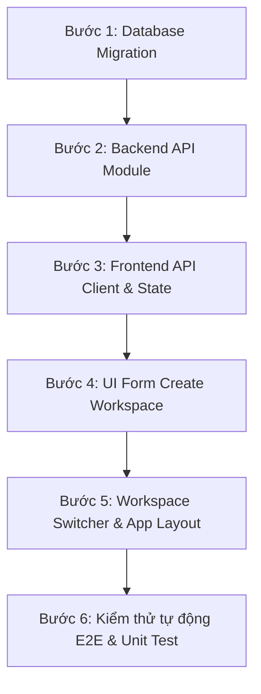

# Phân tích nghiệp vụ & Yêu cầu kỹ thuật: Tính năng Tạo Workspace (Create Workspace)

- **Tài liệu tham khảo:**
  - Draft UI từ hệ thống: [`create-your-workspace-1.png`](./create-your-workspace-1.png), [`create-your-workspace-2.png`](./create-your-workspace-2.png), [`create-your-workspace-3.png`](./create-your-workspace-3.png).
  - Schema cơ sở dữ liệu mẫu: [`sample-workspace.sql`](./sample-workspace.sql).
  - Nền tảng hiện có: [CLAUDE.md](../../../CLAUDE.md), Auth Module (`1-login-page`), Profile Module (`2-profile-page`).
- **Trạng thái:** Bản đề xuất yêu cầu (Requirements & Architecture Spec) cho **OpenPlany**.
- **Phạm vi:**
  - Luồng khởi tạo Workspace mới (sau khi đăng ký lần đầu hoặc tạo thêm từ Workspace Switcher).
  - Kiểm tra tính hợp lệ và tính duy nhất của Workspace Slug theo thời gian thực (Realtime Slug Validation).
  - Khởi tạo quan hệ thành viên và phân quyền Owner/Admin cho người tạo.
  - Tích hợp điều hướng và hiển thị danh sách trên Workspace Switcher.
  - Không bao gồm trong đợt này: Upload logo tùy chỉnh (sẽ kế thừa khi có module `file_assets`), tích hợp thanh toán/billing nâng cao, cấu hình custom domain, cấu hình SSO enterprise.

---

## 1. Mục tiêu và tiêu chí thành công

| Mục tiêu | Tiêu chí đo lường |
| --- | --- |
| Người dùng khởi tạo không gian làm việc nhanh chóng, không bị cản trở | Thời gian hoàn thành form từ lúc mở đến khi tạo xong ≤ 30 giây. API `POST /api/workspaces` phản hồi < 400 ms (p95). |
| Đảm bảo tính toàn vẹn của định danh URL (Slug) | 100% slug được chuẩn hóa (kebab-case), không trùng lặp (unique) và không dẫm vào danh sách từ khóa hệ thống bảo lưu (Reserved Slugs). |
| Thiết lập quyền sở hữu và bảo mật đa khách hàng (Multi-tenant) an toàn | Người tạo được gán vai trò Owner trong cùng một database transaction. Không lộ dữ liệu giữa các workspace độc lập. |
| Trải nghiệm liền mạch giữa Onboarding và Trong ứng dụng | Người dùng mới tạo tài khoản được dẫn thẳng vào tạo workspace; người dùng hiện tại có thể tạo thêm từ Workspace Switcher và chuyển đổi tức thì. |

---

## 2. Bản chất kiến trúc Workspace trong OpenPlany

Trong hệ thống OpenPlany, **Workspace** là ranh giới cao nhất (Root Multi-Tenant Container) đại diện cho tổ chức hoặc công ty:

```text
┌────────────────────────────────────────────────────────┐
│                      WORKSPACE                         │
│  (Tổ chức / Công ty: Thành viên, Phân quyền, Cài đặt)  │
│                                                        │
│   ┌─────────────────────┐      ┌────────────────────┐  │
│   │     Teamspace A     │      │    Teamspace B     │  │
│   └──────────┬──────────┘      └─────────┬──────────┘  │
│              │                           │             │
│   ┌──────────┴──────────┐      ┌─────────┴──────────┐  │
│   │      Project 1      │      │     Project 2      │  │
│   │  (Sản phẩm / Nhóm)  │      │   (Dự án / Mảng)   │  │
│   └──────────┬──────────┘      └─────────┬──────────┘  │
│              │                           │             │
│   ┌──────────┴──────────┐      ┌─────────┴──────────┐  │
│   │     Work Items      │      │    Work Items      │  │
│   │ (Issues, Tasks...)  │      │ (Issues, Tasks...) │  │
│   └─────────────────────┘      └────────────────────┘  │
└────────────────────────────────────────────────────────┘
```

### 2.1 Cấp bậc phân bổ công việc (4 Levels of Organization)
1. **Workspace:** Môi trường cao nhất của tổ chức trong OpenPlany. Nắm giữ con người (Members), phân quyền (Roles/Permissions), tri thức chung (Wiki/Pages), tích hợp (Integrations), và cấu hình chung.
2. **Teamspace (Giai đoạn sau):** Không gian kết nối một nhóm/phòng ban chức năng ổn định xuyên suốt nhiều dự án.
3. **Project:** Không gian cho một sản phẩm cụ thể, luồng công việc hoặc chiến dịch.
4. **Work Item (Issue):** Đơn vị công việc nhỏ nhất (task, bug, story).

### 2.2 Ranh giới của Workspace (Workspace Boundaries)
- **Ranh giới truy cập (Access):** Thành viên chỉ có thể xem và thao tác trên tài nguyên của workspace mà họ được thêm vào.
- **Ranh giới dữ liệu (Data & Reporting):** Các work item, cycle, module không chia sẻ trực tiếp xuyên workspace. Báo cáo, dashboard chỉ tổng hợp trong nội bộ workspace.
- **Ranh giới URL định danh:** Mỗi workspace sở hữu một subdomain hoặc path độc nhất, ví dụ: `app.openplany.dev/:workspaceSlug`.

### 2.3 Khi nào dùng 1 Workspace vs Nhiều Workspace
- **Mặc định:** Một tổ chức nên dùng **1 workspace duy nhất** để giữ mọi dự án, thành viên và tri thức liên kết với nhau.
- **Tạo thêm workspace khi:** Cần ranh giới pháp lý hoàn toàn tách biệt, môi trường kiểm thử/staging riêng, hoặc môi trường độc lập cho từng khách hàng/đối tác bên ngoài.
- Một tài khoản User có thể tham gia hoặc sở hữu **nhiều workspace** khác nhau và chuyển đổi qua lại qua **Workspace Switcher**.

---

## 3. Phân tích Giao diện & Hành vi (UI/UX Analysis)

### 3.1 Màn hình biểu mẫu tạo Workspace (`create-your-workspace-1.png`, `create-your-workspace-2.png`)

Bố cục dạng trang tinh gọn (Centered Clean Form), tập trung tối đa vào thông tin cốt lõi:

| Phần tử UI | Nhãn / Placeholder | Quy tắc hiển thị & Hành vi |
| --- | --- | --- |
| **Tiêu đề chính** | `Create your workspace` | Font kích thước lớn, đậm nét, căn trái trong khối form. |
| **Ô Tên Workspace** | `Name your workspace *`<br>Placeholder: *"Something familiar and recognizable is always best."* | Bắt buộc. Giới hạn 1–80 ký tự. Tự động kích hoạt cơ chế sinh slug ở ô phía dưới khi người dùng nhập. |
| **Ô URL Workspace** | `Set your workspace's URL *`<br>Prefix: `localhost:8080/` (hoặc domain ứng dụng)<br>Placeholder: *"Type or paste a URL"* | Bắt buộc. Giới hạn 1–48 ký tự. Chỉ nhận chữ thường, số, dấu gạch nối `-`. Tự động điền theo tên nhưng cho phép người dùng tự sửa. Kiểm tra trùng/reserved realtime. **Không thể đổi sau khi đã tạo**. |
| **Ô Quy mô tổ chức** | `How many people will use this workspace? *`<br>Placeholder: *"Select a range"* | Bắt buộc. Dropdown lựa chọn các khoảng thành viên định sẵn (`Just myself`, `2-10`, `11-50`, `51-200`, `201-500`, `500+`). |
| **Nút Submit** | `Create workspace` | Ban đầu bị **disabled** (mờ xám). Chỉ kích hoạt khi cả 3 trường đều hợp lệ và slug khả dụng. Khi bấm: hiển thị trạng thái loading, vô hiệu hóa form. |
| **Nút Quay lại** | `Go back` | Quay về màn hình trước đó (nếu đi từ app) hoặc quay về bước trước (nếu trong onboarding). |

### 3.2 Menu chuyển đổi Workspace - Workspace Switcher (`create-your-workspace-3.png`)

Vị trí: Góc trên cùng bên trái của thanh bên (Top-left Sidebar / App Header):

1. **Trigger Button:**
   - Khối nhận diện gồm Logo chữ cái đại diện (ví dụ icon vuông nền xanh chữ trắng `[O]`), Tên workspace hiện tại (`OpenPlany`), và icon mũi tên đóng/mở (`Chevron`).
2. **Popover / Dropdown Content:**
   - **Header:** Hiển thị email của người dùng hiện tại (ví dụ: `kaitranpo@gmail.com`) bằng chữ xám mờ.
   - **Mục Workspace đang hoạt động (Active):**
     - Nền xám nhạt làm nổi bật.
     - Logo vuông + Tên workspace.
     - Dòng phụ: `Admin · 1 Member` (Vai trò của user trong workspace + Tổng số thành viên).
     - Dấu tích xanh/đen `✓` biểu thị đang active.
     - 2 nút hành động nhanh bên dưới: `[⚙ Settings]` và `[+ Invite members]`.
   - **Danh sách Workspace khác:**
     - Các workspace khác mà user đang tham gia (ví dụ: `OpenStudy - Admin · 1 Member`). Bấm vào sẽ chuyển phiên làm việc sang workspace đó.
   - **Đường phân cách (Divider)**
   - **Nhóm hành động chung (Actions):**
     - `(+) Create workspace`: Điểm vào để mở trang/popup tạo workspace mới.
     - `[✉] Workspace invites`: Danh sách lời mời tham gia workspace khác đang chờ chấp nhận.
     - `[⎋] Sign out`: Đăng xuất khỏi tài khoản.

---

## 4. Mô hình Dữ liệu (Database Schema Mapping)

Dựa trên cấu trúc chuẩn từ [`sample-workspace.sql`](./sample-workspace.sql) và thiết kế hệ thống OpenPlany:

### 4.1 Bảng `workspaces`

```sql
CREATE TABLE workspaces (
    id                uuid                     PRIMARY KEY DEFAULT gen_random_uuid(),
    name              varchar(80)              NOT NULL,
    slug              varchar(48)              NOT NULL CONSTRAINT workspaces_slug_key UNIQUE,
    logo              text,
    logo_asset_id     uuid                     CONSTRAINT fk_workspaces_logo_asset_id REFERENCES file_assets (id) ON DELETE SET NULL,
    owner_id          uuid                     NOT NULL CONSTRAINT fk_workspaces_owner_id REFERENCES users (id),
    created_by_id     uuid                     CONSTRAINT fk_workspaces_created_by_id REFERENCES users (id),
    updated_by_id     uuid                     CONSTRAINT fk_workspaces_updated_by_id REFERENCES users (id),
    organization_size varchar(20),
    timezone          varchar(255)             NOT NULL DEFAULT 'UTC',
    background_color  varchar(255)             NOT NULL DEFAULT '#0D1117',
    created_at        timestamp with time zone NOT NULL DEFAULT now(),
    updated_at        timestamp with time zone NOT NULL DEFAULT now(),
    deleted_at        timestamp with time zone
);

CREATE UNIQUE INDEX idx_workspaces_slug_lower ON workspaces (lower(slug)) WHERE deleted_at IS NULL;
```

### 4.2 Bảng thành viên Workspace: `workspace_members` (Thành phần bắt buộc phải có song hành)

Khi một workspace được tạo, người tạo **phải lập tức được thêm vào bảng thành viên** với vai trò cao nhất:

```sql
CREATE TABLE workspace_members (
    id           uuid                     PRIMARY KEY DEFAULT gen_random_uuid(),
    workspace_id uuid                     NOT NULL CONSTRAINT fk_workspace_members_workspace REFERENCES workspaces (id) ON DELETE CASCADE,
    member_id    uuid                     NOT NULL CONSTRAINT fk_workspace_members_user REFERENCES users (id) ON DELETE CASCADE,
    role         varchar(20)              NOT NULL DEFAULT 'owner',
    is_active    boolean                  NOT NULL DEFAULT true,
    created_at   timestamp with time zone NOT NULL DEFAULT now(),
    updated_at   timestamp with time zone NOT NULL DEFAULT now(),
    CONSTRAINT uq_workspace_member UNIQUE (workspace_id, member_id),
    CONSTRAINT chk_workspace_member_role CHECK (role IN ('owner', 'admin', 'member', 'guest'))
);

CREATE INDEX idx_workspace_members_member_id ON workspace_members (member_id) WHERE is_active = true;
```

> **Lưu ý nghiệp vụ về Role:**
> - `owner`: Toàn quyền tối cao, là người duy nhất được xoá workspace, chuyển giao quyền sở hữu hoặc cấu hình thanh toán.
> - `admin`: Quản lý cài đặt dự án, mời/xoá thành viên, bật tắt tính năng.
> - `member`: Tạo và làm việc với issues/projects hàng ngày.
> - `guest`: Khách mời ngoài tổ chức với quyền hạn hạn chế.

---

## 5. Luật nghiệp vụ & Quy tắc kiểm tra (Business Rules)

### 5.1 Quy tắc kiểm tra dữ liệu đầu vào (Validation Rules)

| Trường | Luật kiểm tra | Thông báo lỗi tương ứng |
| --- | --- | --- |
| `name` | Bắt buộc. Sau khi trim: 1–80 ký tự. Không được chỉ toàn khoảng trắng. Không chứa tiền tố URL (`http://`, `https://`). | *"Enter a workspace name"*<br>*"Workspace name must be 80 characters or fewer"*<br>*"Workspace name cannot contain a URL"* |
| `slug` | Bắt buộc. Độ dài 1–48 ký tự. Định dạng chuẩn regex: `^[a-z0-9]+(-[a-z0-9]+)*$`. Không bắt đầu hoặc kết thúc bằng `-`. Không có 2 dấu `-` liên tiếp. | *"Enter a workspace URL"*<br>*"URL must use only lowercase letters, numbers, and hyphens"*<br>*"URL cannot start or end with a hyphen"* |
| `slug` (Reserved) | Không được trùng danh sách từ khóa hệ thống bảo lưu (mục 5.2). | *"This workspace URL is reserved for system use. Please choose another."* |
| `slug` (Unique) | Không được trùng với slug của workspace nào khác đang hoạt động (`lower(slug)`). | *"This workspace URL is already taken. Please choose another."* |
| `organization_size` | Bắt buộc. Phải thuộc tập giá trị enum: `['Just myself', '2-10', '11-50', '51-200', '201-500', '500+']`. | *"Select your organization size"* |

### 5.2 Danh sách từ khóa URL bảo lưu (Reserved Slugs Blacklist)

Nhằm tránh xung đột với các route tĩnh của frontend, API endpoints, hoặc trang tài nguyên hệ thống, các slug sau bị **cấm tuyệt đối**:

```text
admin, api, app, assets, auth, billing, bot, cdn, config, console, 
create-workspace, dashboard, dev, docs, error, favicon.ico, graphql, 
help, home, invite, invitations, jobs, legal, login, logout, 
notifications, oauth, onboarding, org, ping, pricing, privacy, profile, 
public, reset-password, robots.txt, root, security, settings, sign-in, 
sign-out, sign-up, sitemap.xml, static, status, support, sys, system, 
terms, user, users, webhook, webhooks, workspace, workspaces
```

### 5.3 Cơ chế Tự động sinh Slug (Auto-slugification) & Trải nghiệm gõ

1. **Auto-generate:** Khi người dùng nhập vào ô `name`, nếu ô `slug` chưa bị người dùng sửa đổi thủ công (pristine/untouched), hệ thống tự động:
   - Chuyển thành chữ thường (`toLowerCase()`).
   - Loại bỏ dấu tiếng Việt và ký tự đặc biệt (chuyển `à, á...` -> `a`).
   - Thay thế chuỗi khoảng trắng hoặc dấu gạch dưới thành dấu gạch nối `-`.
   - Cắt ngắn nếu vượt quá 48 ký tự.
2. **Manual override:** Khi người dùng chủ động gõ vào ô `slug`, ngừng cơ chế auto-sync từ `name` và đánh dấu ô `slug` là do người dùng tự đặt.
3. **Debounced Live Check:** Phía client gọi API kiểm tra tính khả dụng của slug sau khi người dùng ngừng gõ **300ms** (`GET /api/workspaces/slug-check?slug=...`) để hiển thị thông báo "Available" hoặc "Already taken" ngay lập tức trước khi bấm nút tạo.

### 5.4 Tính chất vĩnh viễn của Slug (URL Immutability)

Quy tắc bất biến:
> *"URL Workspace không thể thay đổi sau khi tạo. Hãy chọn một định danh bền vững, thường là tên công ty/tổ chức. Mọi thông tin khác, bao gồm Tên workspace, đều có thể cập nhật sau trong cài đặt."*

Lý do kỹ thuật:
- Slug là định danh trên đường dẫn URL cho toàn bộ dự án con, issue link, wiki link, webhook và API tokens (`/:workspaceSlug/:project/issues/...`).
- Cho phép đổi slug sẽ gây đứt gãy toàn bộ liên kết (broken links), bookmark, và tích hợp bên thứ ba.
- Vì vậy, tại màn hình tạo cần có nhãn hoặc chú thích cảnh báo người dùng chọn kỹ.

### 5.5 Quy trình Khởi tạo dữ liệu trong 1 Transaction (Provisioning Flow)

Khi API nhận lệnh tạo workspace hợp lệ, toàn bộ quá trình phải diễn ra trong một **Database Transaction**:

```text
Bắt đầu Transaction
  ├── 1. Tạo bản ghi `workspaces` (name, slug, organization_size, timezone, owner_id)
  ├── 2. Tạo bản ghi `workspace_members` (workspace_id, member_id = currentUser.id, role = 'owner')
  ├── 3. (Tuỳ chọn) Tạo dữ liệu mẫu (Seed Project / Sample Work Items) nếu bật cờ
  └── 4. Ghi nhận `last_workspace_id` trong bảng người dùng / cập nhật session
Commit Transaction
```

Nếu bất kỳ bước nào lỗi (ví dụ race condition gây trùng slug), transaction rollback toàn bộ, không tạo ra bản ghi "rác" hay workspace mồ côi.

---

## 6. Hợp đồng API đề xuất (API Specification)

Tuân thủ nghiêm ngặt chuẩn kiến trúc của OpenPlany: NestJS RESTful, camelCase JSON, `SessionGuard` xác thực cookie `op_session`, `OriginGuard` chống CSRF, và mã lỗi chuẩn qua `ApiExceptionFilter`.

### 6.1 Kiểm tra tính khả dụng của Slug (Realtime Check)

`GET /api/workspaces/slug-check?slug=:slug`

- **Yêu cầu bảo mật:** Bắt buộc có phiên đăng nhập hợp lệ (`SessionGuard`).
- **Query Params:**
  - `slug`: chuỗi ký tự slug cần kiểm tra.

**Response `200 OK`:**
```jsonc
{
  "available": true,
  "slug": "openplany-team"
}
```

**Response `200 OK` (Khi không khả dụng):**
```jsonc
{
  "available": false,
  "slug": "admin",
  "reason": "RESERVED" // 'RESERVED' | 'ALREADY_EXISTS' | 'INVALID_FORMAT'
}
```

### 6.2 Khởi tạo Workspace mới

`POST /api/workspaces`

- **Headers:** `Content-Type: application/json`, `Origin: <CORS_ORIGIN>`
- **Bảo mật:** `SessionGuard`, `OriginGuard`

**Request Body:**
```jsonc
{
  "name": "Acme Corporation",
  "slug": "acme-corp",
  "organizationSize": "11-50"
}
```

**Response `201 Created`:**
```jsonc
{
  "id": "e4b2d5a1-7c38-4f9e-912b-3a5e8c1029ab",
  "name": "Acme Corporation",
  "slug": "acme-corp",
  "organizationSize": "11-50",
  "timezone": "UTC",
  "backgroundColor": "#0D1117",
  "role": "owner",
  "memberCount": 1,
  "createdAt": "2026-10-08T14:30:00.000Z"
}
```

**Mã lỗi có thể trả về:**

| Mã HTTP | Mã lỗi (`code`) | Ý nghĩa & Xử lý |
| --- | --- | --- |
| `400` | `VALIDATION_ERROR` | Tên rỗng, slug sai định dạng regex, hoặc thiếu `organizationSize`. Trả về chi tiết trường trong object `fields`. |
| `401` | `UNAUTHORIZED` | Chưa đăng nhập hoặc cookie phiên hết hạn. |
| `403` | `FORBIDDEN` | Tài khoản bị vô hiệu hóa (`is_active = false`), tài khoản bot, hoặc vi phạm `OriginGuard`. |
| `409` | `SLUG_ALREADY_EXISTS` | Slug đã có workspace khác sử dụng (xử lý race condition khi 2 người cùng submit 1 lúc). |
| `422` | `SLUG_RESERVED` | Slug nằm trong danh sách từ khóa hệ thống bảo lưu. |

### 6.3 Lấy danh sách Workspace của người dùng (Phục vụ Workspace Switcher)

`GET /api/workspaces`

- **Bảo mật:** `SessionGuard`
- **Mục đích:** Lấy danh sách tất cả workspace mà người dùng đang tham gia để render menu ở góc trái trên web.

**Response `200 OK`:**
```jsonc
[
  {
    "id": "e4b2d5a1-7c38-4f9e-912b-3a5e8c1029ab",
    "name": "OpenPlany",
    "slug": "openplany",
    "logo": null,
    "role": "owner",
    "memberCount": 1,
    "isActive": true
  },
  {
    "id": "7b1029ab-4f9e-7c38-912b-e4b2d5a13a5e",
    "name": "OpenStudy",
    "slug": "openstudy",
    "logo": null,
    "role": "admin",
    "memberCount": 5,
    "isActive": false
  }
]
```

---

## 7. Phân tích Hiện trạng & Khoảng trống trong OpenPlany (Gap Analysis)

| Hạng mục | Hiện trạng của OpenPlany | Cần bổ sung để hoàn thiện tính năng |
| --- | --- | --- |
| **Database Migration** | Mới chỉ có migration `CreateAuthTables` (bảng `users`, `sessions`, `login_attempts`). Chưa có bảng workspace. | Tạo migration `CreateWorkspaceTables` định nghĩa bảng `workspaces` và `workspace_members` theo chuẩn TypeORM. |
| **Backend Entities & Module** | Mới có `AuthModule` và `UsersModule`. | Tạo mới `workspaces/` module gồm: `workspace.entity.ts`, `workspaceMember.entity.ts`, `workspaces.repository.ts`, `workspaces.service.ts`, `workspaces.controller.ts`, các DTOs class-validator. |
| **Transaction & Business Logic** | Chưa có logic tạo workspace kết hợp gán quyền thành viên. | Cài đặt TypeORM Transaction / DataSource QueryRunner để đảm bảo tính nguyên tử khi tạo workspace và owner member. |
| **Reserved Slugs Blacklist** | Chưa có danh sách từ khóa cấm. | Bổ sung file hằng số `reservedSlugs.ts` dùng chung hoặc kiểm tra tại service level. |
| **Frontend Routing** | Router hiện tại chỉ có `/`, `/sign-in`, `/forgot-password`, `/set-password`. | Thêm route `/create-workspace` (dành cho onboarding và tạo mới) và dynamic route `/:workspaceSlug/*` cho không gian làm việc chính. |
| **Frontend State & Context** | Chỉ có `AuthContext` (lưu phiên user). | Cần có `WorkspaceContext` để lưu danh sách workspace của user, thông tin workspace đang active, và hàm `switchWorkspace(slug)`. |
| **UI Components** | Đã có Mantine UI, `AppHeader` (Profile popup). | Xây dựng `CreateWorkspacePage.tsx` (Form tạo workspace chuẩn theo `create-your-workspace-1/2`), và `WorkspaceSwitcher.tsx` (Menu popover chuẩn theo `create-your-workspace-3`). |

---

## 8. Tiêu chí nghiệm thu (Acceptance Criteria - Gherkin Format)

### Kịch bản 1: Mở form và tự động sinh Slug
- **Given** người dùng đã đăng nhập và đang ở trang `/create-workspace`.
- **When** người dùng nhập `"OpenPlany Dev Team"` vào ô *Name your workspace*.
- **Then** ô *Set your workspace's URL* tự động hiển thị giá trị `"openplany-dev-team"`.
- **And** client tự động gọi kiểm tra slug và hiển thị trạng thái hợp lệ.

### Kịch bản 2: Nhập Slug trùng hoặc thuộc danh sách bảo lưu
- **Given** người dùng đang ở form tạo workspace.
- **When** người dùng nhập slug là `"admin"` hoặc một slug đã tồn tại trong database.
- **Then** dưới ô URL hiển thị thông báo lỗi rõ ràng (*"This workspace URL is reserved"* hoặc *"This workspace URL is already taken"*).
- **And** nút *Create workspace* tiếp tục bị khóa (disabled).

### Kịch bản 3: Tạo Workspace thành công trọn vẹn
- **Given** người dùng điền đầy đủ Tên, URL hợp lệ và chọn Quy mô tổ chức `"2-10"`.
- **When** người dùng bấm nút *Create workspace*.
- **Then** nút chuyển sang trạng thái loading để tránh bấm 2 lần.
- **And** API `POST /api/workspaces` trả về mã `201 Created`.
- **And** trong database có 1 bản ghi `workspaces` và 1 bản ghi `workspace_members` với `role = 'owner'` gắn với `userId` của phiên hiện tại.
- **And** người dùng được tự động chuyển hướng vào màn hình làm việc chính `/:workspaceSlug`.

### Kịch bản 4: Sử dụng Workspace Switcher
- **Given** người dùng đã có 2 workspace (`OpenPlany` và `OpenStudy`).
- **When** người dùng click vào tên workspace ở góc trên bên trái thanh điều hướng.
- **Then** một menu popover mở ra hiển thị email người dùng, workspace hiện tại có dấu tích `✓`, workspace còn lại, cùng 3 tùy chọn: *Create workspace*, *Workspace invites*, *Sign out*.
- **When** người dùng click vào nút *Create workspace* trong popover.
- **Then** ứng dụng điều hướng đến `/create-workspace`.

---

## 9. Kế hoạch triển khai kỹ thuật (Technical Implementation Plan)



1. **Bước 1 (Database):** Viết migration TypeORM tạo bảng `workspaces` và `workspace_members`, kèm theo unique index cho `lower(slug)`.
2. **Bước 2 (API):** 
   - Tạo `workspaces.module.ts`.
   - Tạo DTO `CreateWorkspaceDto` với `class-validator` (`Length`, `Matches`, `IsIn`).
   - Cài đặt service xử lý tạo workspace bằng transaction và kiểm tra reserved slug.
   - Viết controller cung cấp 3 endpoint: `check-slug`, `create`, `list`.
3. **Bước 3 (Web Client & Context):** Tạo `workspaceApi.ts` và tích hợp `WorkspaceContext` để quản lý active workspace.
4. **Bước 4 (Web Form UI):** Xây dựng trang `CreateWorkspacePage.tsx` theo Mantine 7, hỗ trợ live slugification, dropdown quy mô tổ chức, responsive cho mobile.
5. **Bước 5 (Switcher UI):** Xây dựng `WorkspaceSwitcher.tsx` tích hợp vào `AppHeader` / sidebar.
6. **Bước 6 (Testing):** Viết unit test cho DTO/Service và e2e test với Vitest + Supertest cho toàn bộ luồng tạo và phân quyền.

---

## 10. Các câu hỏi cần làm rõ & Quyết định thiết kế (Open Questions & Decisions)

| # | Câu hỏi / Vấn đề | Đề xuất giải quyết cho OpenPlany |
| --- | --- | --- |
| **Q1** | Cấu trúc URL định tuyến web nên dùng `/:workspaceSlug` hay `/workspaces/:workspaceSlug`? | **Đề xuất: Dùng `/:workspaceSlug`** (ví dụ `app.openplany.dev/acme/projects`). Điều này đòi hỏi danh sách Reserved Slugs phải bao gồm mọi route cấp 1 của web (`login`, `settings`, `profile`...). |
| **Q2** | Khi tạo workspace mới, có nên tự động tạo 1 Dự án mẫu (Sample Project) kèm một số issue mẫu không? | **Đề xuất: Ở MVP giai đoạn 1, chỉ tạo workspace trống** để giữ backend đơn giản. Thêm cờ `createSampleProject` vào backlog giai đoạn sau khi đã hoàn thiện module Projects/Issues. |
| **Q3** | Giới hạn số lượng workspace một người dùng được tạo? | **Đề xuất: Không giới hạn cứng về mặt logic**, nhưng đặt rate-limit (tối đa 5 workspace / 1 giờ / 1 user) để ngăn chặn hành vi spam hoặc cạn kiệt tài nguyên hệ thống. |
| **Q4** | Xử lý Timezone mặc định của Workspace như thế nào? | **Đề xuất: Kế thừa từ `user_timezone` của người tạo** (đã có trong bảng `users`), nếu không có thì fallback về `'UTC'`. Người dùng có thể đổi lại sau trong Workspace Settings. |
| **Q5** | Màu nền đại diện (`background_color`) và Logo mặc định? | **Đề xuất: Sinh màu ngẫu nhiên từ bảng màu thương hiệu** (hoặc mặc định `#0D1117`), logo mặc định là chữ cái đầu tiên của tên workspace viết hoa (hiển thị trên `Avatar` vuông bo góc). |

